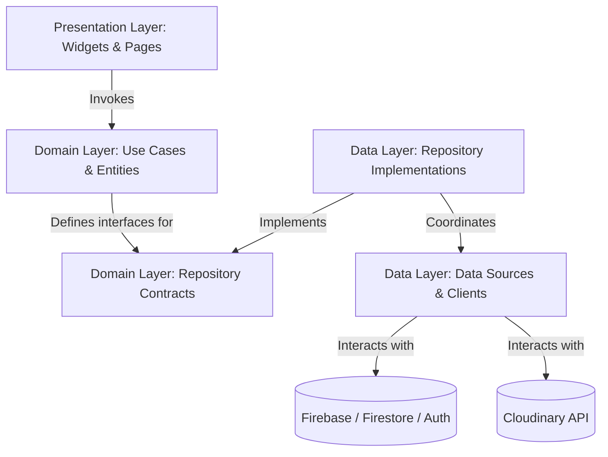
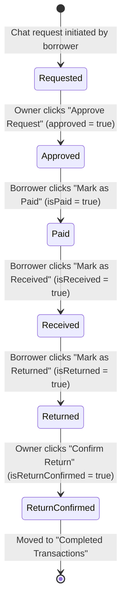

# Lendly System Architecture 🏗️

This document describes the architectural patterns, directory structure, data flows, and configuration strategies of the Lendly application.

---

## 🏛️ Architectural Overview

Lendly is designed using a **modular, Feature-First Clean Architecture** approach. This ensures separation of concerns, high testability, and clarity as the application grows.

### 📐 Structural Layers
Each feature module under `lib/features/` is split into three main layers:



1.  **Presentation Layer (`presentation/`)**:
    *   Contains UI pages, reusable widgets, and dialogues.
    *   Subscribes directly to repository data streams using `StreamBuilder`/`FutureBuilder` widgets.
    *   Manages local visual states (such as loading indicators, dropdown selections, input validation) using Flutter's built-in `StatefulWidget` and `setState`.
2.  **Domain Layer (`domain/`)**:
    *   **Entities**: Pure Dart objects representing domain concepts (e.g., [Item](file:///c:/Users/palen/OneDrive/Documents/GitHub/lendly/lib/features/items/domain/entities/item.dart), [Conversation](file:///c:/Users/palen/OneDrive/Documents/GitHub/lendly/lib/features/chat/domain/entities/conversation.dart)). Free from any third-party framework code.
    *   **Repositories**: Interface contracts (e.g., [ItemRepository](file:///c:/Users/palen/OneDrive/Documents/GitHub/lendly/lib/features/items/domain/repositories/item_repository.dart)) outlining the database operations.
    *   **Use Cases**: Simple application logic wrappers (e.g., [PaymentUseCase](file:///c:/Users/palen/OneDrive/Documents/GitHub/lendly/lib/features/payments/domain/usecases/payment_use_case.dart)).
3.  **Data Layer (`data/`)**:
    *   **Models**: Data Transfer Objects (DTOs) with serialization methods (e.g., `toMap()`, `fromFirestore()`, `fromDocument()`) extending or mapping to domain entities.
    *   **Repositories Implementation**: Concrete implementations of domain repository contracts (e.g., [ItemRepositoryImpl](file:///c:/Users/palen/OneDrive/Documents/GitHub/lendly/lib/features/items/data/repositories/item_repository_impl.dart)). They orchestrate remote datasources, file uploads, and handle conversions.
    *   **Data Sources (`datasources/`)**: Handles low-level platform APIs and integrations (e.g., Firebase Authentication, Firestore databases, and Stripe SDK connections).

---

## 📁 Folder Directory Structure

```text
lib/
├── core/
│   ├── config/             # Environment & service options (FirebaseOptions)
│   ├── services/           # Platform integrations (e.g. Cloudinary conditional client)
│   └── utils/              # Generic utilities (e.g. convo_id generators)
├── features/
│   ├── auth/               # User account flows (login, signup, session wrappers)
│   ├── chat/               # Live peer-to-peer user-to-user messaging & approvals
│   ├── items/              # Item directory feed, detail views, and item listings
│   ├── payments/           # Stripe flow (UseCases, callables, Stripe keys)
│   ├── profile/            # User dashboards, edit panels, and review listings
│   └── (insurance, requests, search_filter) # Skeletons representing future modules
├── shared/
│   ├── widgets/            # Globally shared components
│   └── utils/              # Shared helper functions
└── main.dart               # Core bootstrapping class initializing Firebase options
```

---

## 🔄 Data Flow & State Management

Lendly implements a **Reactive, Stream-driven State Architecture** using Firebase streams. Although `provider` is declared in `pubspec.yaml`, the codebase currently skips local state providers in favor of direct Firebase Firestore real-time updates.

### 🌊 Reactive Stream Pipeline
```text
  [Firebase Firestore] 
         │ (Real-Time Streams / Snapshots)
         ▼
  [Data Source / Repository Layer] 
         │ (Stream of List<Entities> or DocumentSnapshot)
         ▼
  [Presentation / Widget Layer]
         │ (StreamBuilder / FutureBuilder Widget)
         ▼
  [Reactive UI Render & Local state] <─── (setState for visual status changes)
```

### 1. Authentication State Flow
1.  On startup, [main.dart](file:///c:/Users/palen/OneDrive/Documents/GitHub/lendly/lib/main.dart) calls `Firebase.initializeApp(...)`.
2.  The root widget renders [AuthWrapper](file:///c:/Users/palen/OneDrive/Documents/GitHub/lendly/lib/features/auth/presentation/pages/auth_wrapper.dart).
3.  `AuthWrapper` sets up a `StreamBuilder` listening to `FirebaseAuth.instance.authStateChanges()`:
    *   **No Active User**: Render `LoginPage`.
    *   **Active but Email Unverified**: Render `LoginPage` with a prompt to check email inbox.
    *   **Active and Verified**: Render `HomeScreen`.

### 2. Live Chat Flow
1.  `ConversationScreen` mounts and triggers `getUserConversations(currentUserId)` from [ChatRepositoryImpl](file:///c:/Users/palen/OneDrive/Documents/GitHub/lendly/lib/features/chat/data/repositories/chat_repository_impl.dart#L64).
2.  Firestore emits snapshots of the `/conversations` collection where `participants` array contains the user's UID.
3.  When a conversation is tapped, `ChatScreen` renders and subscribes to:
    *   `/conversations/{convoId}/messages` subcollection ordered by `timestamp` ascending.
    *   Updates in `/conversations/{convoId}` to track transaction approval status.
4.  Sending a message updates the parent `/conversations/{convoId}` document (`lastMessageText` and `lastUpdated`) and adds a message document to `/conversations/{convoId}/messages` in Firestore.

### 3. Borrowing & Transaction Lifecycles
Transactions (Lending agreements) are managed directly on the Firestore `/conversations` document using specific boolean flags. The dashboard [BorrowedItemsScreen](file:///c:/Users/palen/OneDrive/Documents/GitHub/lendly/lib/features/items/presentation/pages/borrowed_items_screen.dart) listens for changes:



---

## ☁️ Cloud Services & Storage Strategy

### 🛡️ Firestore Security Rules
Access control is enforced at the database level using rules located in [firebase/firestore.rules](file:///c:/Users/palen/OneDrive/Documents/GitHub/lendly/firebase/firestore.rules).
*   **Conversations / Messages**: Restricts access to users listed in the conversation ID. The ID is formatted as `uid1_uid2` which is split to check if `request.auth.uid in convoId.split('_')`.

### 🖼️ Cloudinary Integration (Image Uploads)
Instead of standard Firebase Storage, Lendly stores images using **Cloudinary** REST endpoints.
*   **Firebase Storage**: Configured with `allow read, write: if false;` in [firebase/storage.rules](file:///c:/Users/palen/OneDrive/Documents/GitHub/lendly/firebase/storage.rules).
*   **Profile Image Uploads**: Profile edits trigger `uploadProfilePicture()` in [FirebaseUserService](file:///c:/Users/palen/OneDrive/Documents/GitHub/lendly/lib/features/profile/data/datasources/firebase_user_service.dart#L83) which calls `CloudinaryService.uploadImage()`.
*   **Multi-Platform Compiles**: To avoid compilation errors on the Web (since web does not support `dart:io` files), `CloudinaryService` uses **conditional exports**:
    *   [cloudinary_service.dart](file:///c:/Users/palen/OneDrive/Documents/GitHub/lendly/lib/core/services/cloudinary/cloudinary_service.dart) acts as the bridge.
    *   [cloudinary_service_web.dart](file:///c:/Users/palen/OneDrive/Documents/GitHub/lendly/lib/core/services/cloudinary/cloudinary_service_web.dart) executes HTML file pickers and uploads binary arrays.
    *   [cloudinary_service_mobile.dart](file:///c:/Users/palen/OneDrive/Documents/GitHub/lendly/lib/core/services/cloudinary/cloudinary_service_mobile.dart) handles file picked paths with `image_picker` and uploads via `dart:io` files.
*   **⚠️ Note for Development**: [ItemRepositoryImpl](file:///c:/Users/palen/OneDrive/Documents/GitHub/lendly/lib/features/items/data/repositories/item_repository_impl.dart#L46) contains an inline upload method that relies on `dart:io` files. This restricts item creation/editing uploads to mobile-only compiled versions. Future refactoring should migrate this to use the unified `CloudinaryService`.

### 💳 Payment Backend (Firebase Cloud Functions + Stripe)
*   **Frontend**: Renders [PayButton](file:///c:/Users/palen/OneDrive/Documents/GitHub/lendly/lib/features/payments/presentation/widgets/pay_button.dart) and triggers [PaymentUseCase](file:///c:/Users/palen/OneDrive/Documents/GitHub/lendly/lib/features/payments/domain/usecases/payment_use_case.dart) using `flutter_stripe`.
*   **Callable Cloud Functions**: The mobile client calls the Firebase HTTPS callable function `createPaymentIntent` defined in [functions/index.js](file:///c:/Users/palen/OneDrive/Documents/GitHub/lendly/functions/index.js#L6).
*   **Stripe SDK Integration**: The backend Cloud Function contacts the Stripe API using `STRIPE_SECRET_KEY` loaded from `functions/.env` to retrieve a `clientSecret` and sends it back to the mobile app to display the Stripe native Payment Sheet.
